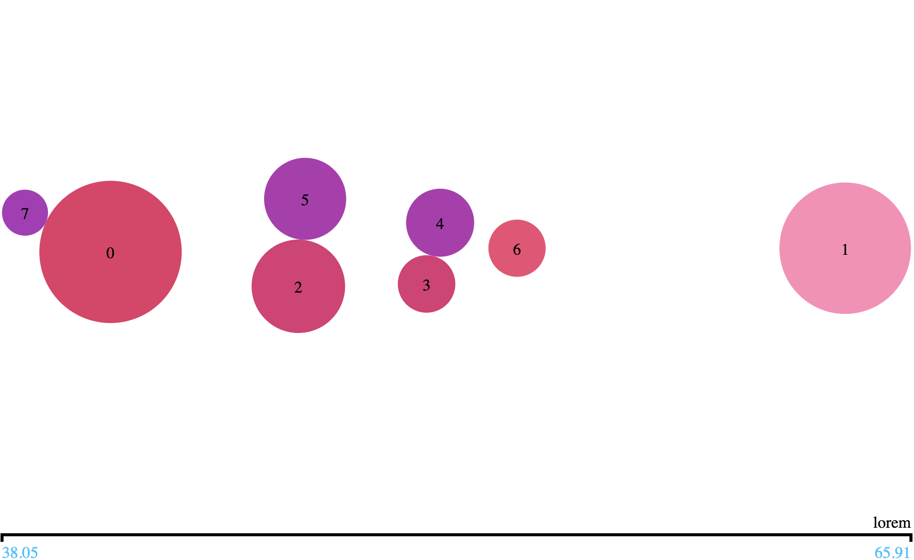
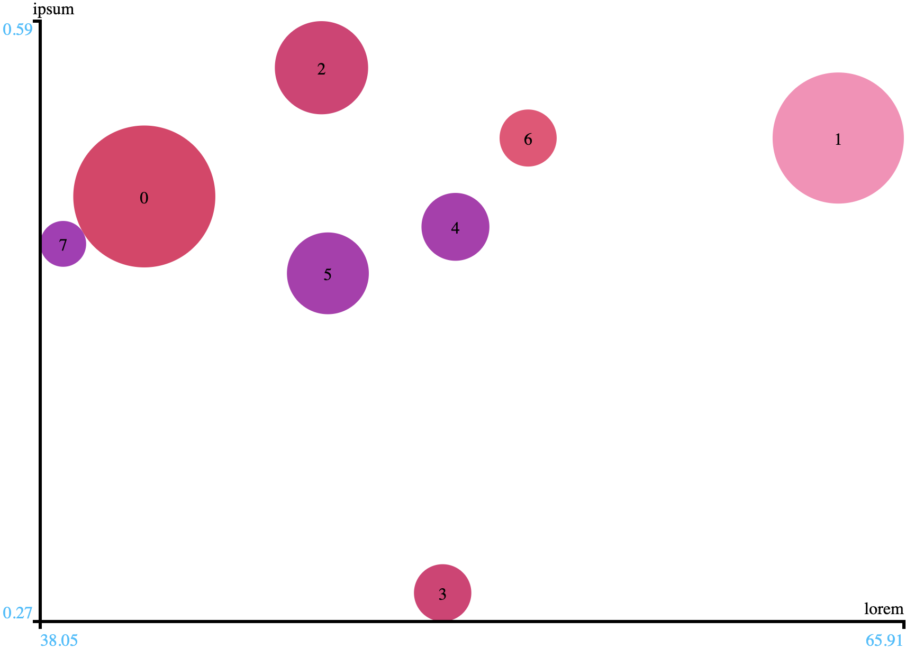

# bubbles

> a 4D matrix visualization library

# Introduction

The library allows to visualize 3D or 4D matrix in a browser.
We use it for displaying the result of a clustering algorithm.
Each row of the matrix is represented as a filled circle or a "bubble".
For us a bubble represents a cluster.
Two types of charts are available:

`XChart` for 3D charts: 
elements are spread horizontally following the first dimension, 
the two other dimensions are represented by bubbles color and area.
The bubbles are positioned vertically in order to avoid overlays.


`XChart` for 4D charts: 
elements are spread horizontally and vertically following the first and the second dimension,
the two other dimensions are represented by bubbles color and area.
The bubbles are repositioned in order to avoid overlays (the position may not be accurate).


X and Y axis have square root scales which is a generally good compromise 
if few bubbles are far away the other. This might happen with clustering results.

The area is also scaled to avoid very small or huge bubbles.
Generally we bind the bubble area to cluster cardinality.

# Installation

The bundle is built with [rollup](https://rollupjs.org/guide/en/).

First install rollup:
```bash
$ npm install --global rollup
```

or

```bash
$ yarn global add rollup
```

Then build the bundle:
```bash
$ rollup -c
```

The library is contained in the resulting `bubbles.js` file.

The bundle may be used in the browser:

```html
<script src="bubbles.js"></script>
```

as well as a Node.js package:

```javascript
const bub = require('./bubbles.js')
``` 

# Usage

The bundle contains the following components :

- `bubbles`: a factory that build bubble charts
- `XYChart`: represents a 4D matrix chart
- `XChart`: represents a 3D matrix chart

The `bubbles` factory has 3 methods that construct charts as `Bubbles` instances :

**_`bubbles.create`_**: creates a new empty chart

parameter name | description
-------------- | -----------
selector       | a CSS selector that uniquely defines a div that will contain the chart
builder        | one of `XYChart` or `XChart` for 4D or 3D chart
listeners      | a dictionary of event to callback mappings

**_`bubbles.update`_**: creates a new chart by updating the data displayed in an existing chart

parameter name | description
-------------- | -----------
chart          | a bubble instance of an existing chart
builder        | one of `XYChart` or `XChart` for 4D or 3D chart
data           | the content and column names of the matrix

**_`bubbles.resize`_**: creates a new chart by resizing an existing chart

parameter name | description
-------------- | -----------
chart          | a bubble instance of an existing chart

The following line of code creates a chart in the div which id is `viz` :
```javascript
var viz = bub.bubbles.create("#viz", bub.XYChart, {"click": displayClusterContent});
```
`displayClusterContent` is a callback executed when the chart is clicked. The listeners
can map any event that can be bound to a div element. For instance :
```javascript
const listeners = {"click": onClick, "mousemove": onMove, "mouseout": onOut}
var viz = bub.bubbles.create("#viz", bub.XYChart, listeners);
```
Once a chart has been created, it can be updated with new data:
```javascript
const elements = [
  [1.4, 3.0, 4.2, 3.1],
  [20.4, 23.3, 30.2, 21.8],
  [1.5, 34.6, 19.9, 10.5]]
const columnNames = ["lorem", "ipsum", "dolor", "sit"]
viz = bub.bubbles.update(viz, bub.XYChart, {elements, columnNames});
```
Data is always a 4 columns matrix, for :
 1. the X axis value
 1. the Y axis vales
 1. the area of the bubbles
 1. the color of the bubbles
 
If the chart type is set to `XChart`, the second column is ignored and the bubbles
are disposed on a single axis.

When the container size changes, the chart can be resized:
```javascript
viz = bub.bubbles.resize(viz)
```

Not that each time something is updated, a new `Bubbles` instance is produced, 
thus the variable referencing the instance must be updated (`viz` in our examples).
Under the hood, the DOM elements are reused in order to optimize the display.

# CSS classes

The display can be customized thanks to specific classes:

class names |  description
----------- |  -----------
`.chart` | container of the chart
`.chart .cluster` | a bubble
`.chart .label` | the label of a bubble
`.chart .info` | the information tool tip over a bubble
`.x-axis`   | container of the X axis
`.y-axis`   | container of the Y axis
`.x-axis .axis`   | the axis line of a X axis
`.x-axis .label`   | the label of a X axis
`.x-axis .value`   | the axis values of a X axis
`.y-axis .axis`   | the axis line of a Y axis
`.y-axis .label`   | the label of a Y axis
`.y-axis .value`   | the axis values of a Y axis


